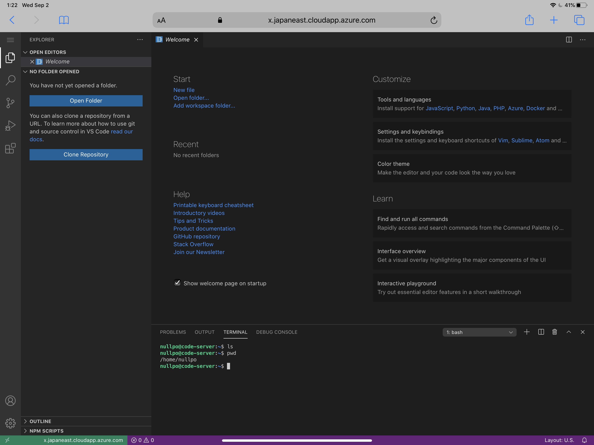
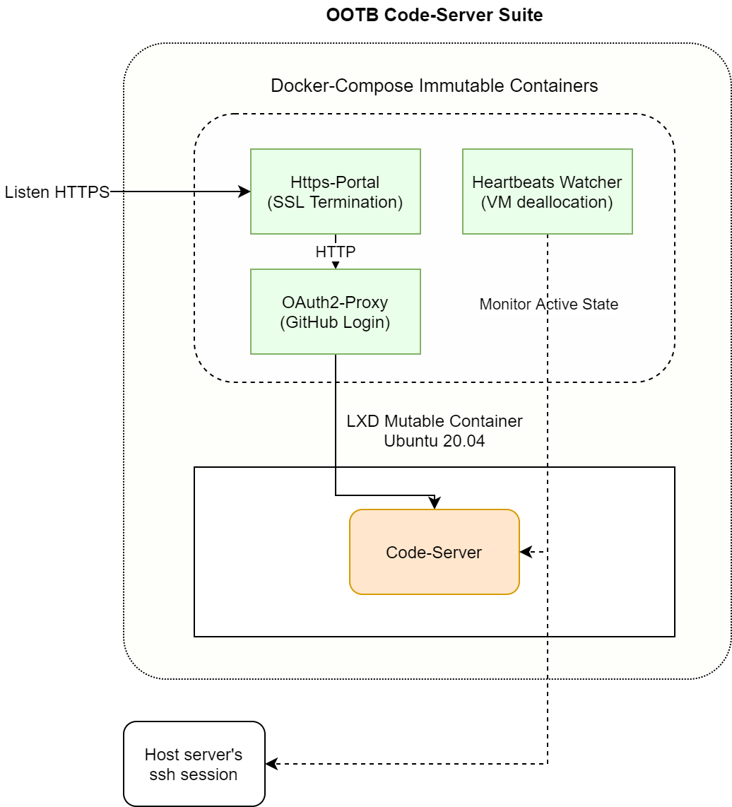

# OOTB Code-Server

OOTB Code-Server is an out-of-the-box [Code-Server](https://github.com/cdr/code-server) environment.

[Code-Server](https://github.com/cdr/code-server) is an OSS product developed by [Coder technologies](https://coder.com/) that allows you to run [VS Code](https://github.com/Microsoft/vscode) on any machine and to access it in the browser.  
However, to install Code-Server on a server, you have to set up an Https proxy server, an authentication mechanism for security, automatic shutdown if the server is hosted in the cloud, and much more.  
OOTB Code-Server provides these mechanisims with just a few settings.

OOTB Code-Server is equipped with

1. HTTPS powered by Let's Encrypt and [https-portal](https://github.com/SteveLTN/https-portal)
2. Authorization by your GitHub account powered by [OAuth2 Proxy](https://github.com/oauth2-proxy/oauth2-proxy)
3. Mutable LXC Code-Server container, inside which you can do any mutable things as you usually do in an Ubuntu machine
4. Automatic deallocation of your VM after 15-minutes idle time (Currently Azure VM is supported)

OOTB Code-Server consists of Docker-Compose containers for immutable components such as Https proxy and GitHub auth proxy,
and a LXC container for mutable Code-Server environment.




## Getting Started

### 0. Prerequisites

Please install `docker`, `docker-compose`, and `lxd`. Ubuntu has `lxd` by default.

### 1. Clone this repository

Please clone this repository to a good location

```bash
$ git clone https://github.com/nullpo-head/Out-of-Box-CodeServer-Environment.git ~/ootb-code-server
```

### 2. Set up environment variables

1. Copy `.env.example` to `.env`

   ```bash
   $ cd ootb-code-server
   $ cp ./helper_containers/.env.example ./helper_containers/.env
   ```

   Pleaes edit `.env` as follows

2. DNS Name

   Rewrite `CODER_HOST` to your server's DNS name. Let's Encrypt will issue a certificate for this domain.  
   For example, if you use an Azure VM, it has a name like this

   ```
   CODER_HOST=my-ootb-codeserver.japaneast.cloudapp.azure.com
   ```

3. GitHub Authorization

   Create a new OAuth App at https://github.com/settings/developers.  
   "Homepage URL" is the domain you host your code-server. Let's suppose it's `https://yourdomain.com` here. Then, "Authorization callback URL" is `https://yourdomain.com/oauth2/callback`. Please note that you use `https://` because OOTB Code-Server enables https.
   If you want to know more about this settings, please refer to [the doc of OAuth2 Proxy](https://oauth2-proxy.github.io/oauth2-proxy/)

   Please fill in `OAUTH2_PROXY_CLIENT_ID` and `OAUTH2_PROXY_CLIENT_SECRET` in `.env` according to the app you created.

   Put your email address in `emails` file. Only the email address listed here are allowed to login to your Code-Server.

   ```bash
   $ echo 'your.email.address@example.com' > ~/ootb-code-server/helper_containers/emails
   ```

4. **(Optional)** Automatic Deallocation of Your VM (Azure is only supporeted)

   If you enable automatic deallocation of your VM,
   rewrite `HEARTBEATS_ACTION` so that it corresponds to your VM.

   ```
   HEARTBEATS_ACTION="az vm deallocate --subscription 'Put Your Subscription Here' -g 'Put Your Resource Group Name Here' -n 'Put Your VM Name Here'"
   ```

   You can set `HEARTBEATS_TIMEOUT` to determine how many minutes of idle time the VM will deallocate after. The default minutes is 15.  
   By this configuration, your Azure VM is deallocated after Code-Server is idle for 15 minutes and there is no session of ssh and Bash for 15 minutes.

   Azure VM is only supported right now because the author is an Azure user. Any PRs to support other clouds are welcome.
   
   __NOTE__:
      - Automatic deallocation doesn't work if you **connect to Code-Server from iPad**. Please see [the issue of Code-Server](https://github.com/cdr/code-server/issues/2061).
      - Automatic deallocation doesn't work if you **computer sleep but the browser tab is not closed**. Please see [heartbeat file modify date keeps getting updated](https://github.com/cdr/code-server/issues/2112#issuecomment-813056958).
        - One way is to install Azure App on your phone and check if the VM is deallocated at any time (recommended).
        - Another way is to use the azure vm auto shutdown feature.
        - You can check connections between the browser and the code server with `sudo ss -tpn` in host machine.

   __How TO Start VM__:
      - Start Azure VM with `az vm start --subscription 'Your Subscription' -g 'Your Resource Group' -n 'Your VM name'`

   __How TO Deallocate(not stop, deallocate will stop billing) VM__:
      - Deallocate Azure VM with `az vm deallocate --subscription 'Your Subscription' -g 'Your Resource Group' -n 'Your VM name'`

### 3. Initialize OOTB Code-Server

**First**, please make sure that `80` and `443` ports are not used by other web servers.  
Installtion will fail if they are not available. If it fails, re-run `install.sh` after making those ports available.

Run `install.sh`, following the instruction it prompts.

```bash
$ ./install.sh
```

After that, you can access your Code-Server at `https://your-host-name`.

Containers of OOTB Code-Server will automatically launch when your server starts.

## Stop / Start / Monitor Containers

OOTB Code-Server consists of Docker Compose and LXD. So, you can controll containers by `docker-compose` and `lxc`.

Login code server as root by `lxc shell ootb-code-server`

### Stop

```bash
$ lxc stop ootb-code-server
$ cd ~/ootb-code-server/helper_containers
$ sudo docker-compose stop  # or `down` to delete containers
```

### Start

You can start them again by

```bash
$ lxc start ootb-code-server
$ cd ~/ootb-code-server/helper_containers
```

1. If you don't enable automatic VM deallocation,
   ```bash
   $ sudo docker-compose up -d https-portal oauth2-proxy
   ```
2. If you enable automatic VM deallocation,
   ```bash
   $ sudo docker-compose up -d
   ```

They will launch automatically when your server launces, as long as they are running when you shutdown your server.

### Monitor

You can monitor containers by

```bash
$ lxc ls
+------------------+---------+---------------------+--------+------------+-----------+
|       NAME       |  STATE  |        IPV4         |  IPV6  |    TYPE    | SNAPSHOTS |
+------------------+---------+---------------------+--------+------------+-----------+
| ootb-code-server | RUNNING | 10.238.18.27 (eth0) |        | PERSISTENT | 0         |
+------------------+---------+---------------------+--------+------------+-----------+
```

and

```bash
$ cd ~/ootb-code-server/helper_containers
$ sudo docker-compose ps
CONTAINER ID        IMAGE                               COMMAND               CREATED             STATUS              PORTS                                      NAMES
7c9806549c66        steveltn/https-portal:1             "/init"               2 hours ago         Up 2 hours          0.0.0.0:80->80/tcp, 0.0.0.0:443->443/tcp   helper_containers_https-portal_1
6f0ce90981c9        quay.io/oauth2-proxy/oauth2-proxy   "/bin/oauth2-proxy"   2 hours ago         Up 2 hours                                                     helper_containers_oauth2-proxy_1
```

## How to resize disk size dynamicly

If code server disk is not enough to use, it is not need to reinstall it, becasue it use lxc zfs filesystem and it can resize dynamicly! Below is the operate steps:

1. Resize the disk in Azure vm disk manager, just stop the vm and resize the disk and restart the vm, everything is back and the disk is resized.
2. Resize lxc storage.
```bash
sudo apt install zfsutils-linux # to get the zfs command

zfs list -t all
# this lists loads of stuff, but "default" is at the top
# and shows the amount of space I had, which was 27GB

sudo ls /var/snap/lxd/common/lxd/disks/default.img
# this file exists, confirming that I have ZFS, it's using a loop file,
# it's called "default", and I'm using the snapped LXD

lxc stop ootb-code-server --force # stop code server container; if it is stuck, just stop forcely
sudo snap stop lxd # for non-snap this might be sudo service stop lxd?
# unsure if stopping lxd is required before fiddling with the ZFS stuff

sudo truncate -s +10G /var/snap/lxd/common/lxd/disks/default.img
# I wanted to add 10G of space because, as above, I told
# the container it had 40GB rather than the 30GB it had already

# for the below the docs say "lxd", not "default", as the pool name
# if you put the wrong name you get "cannot open 'lxd': no such pool"
sudo zpool set autoexpand=on default
sudo zpool online -e default /var/snap/lxd/common/lxd/disks/default.img
sudo zpool set autoexpand=off default

sudo snap start lxd # and restart lxd
lxc start ootb-code-server # and code server container
```

## How to upgrade code-server

Execute these commands in code server(shell or browser):

```
curl -fsSL https://code-server.dev/install.sh | sh
systemctl --user restart code-server
```

## How to reduce server costs

1. Use azure server deallocate feature, or use azure app to start/stop server.
2. Server disk uses `Standard HDD LRS` type, size is `64GB`.
